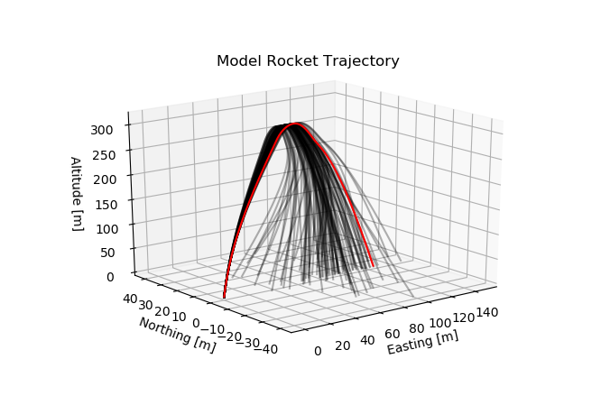
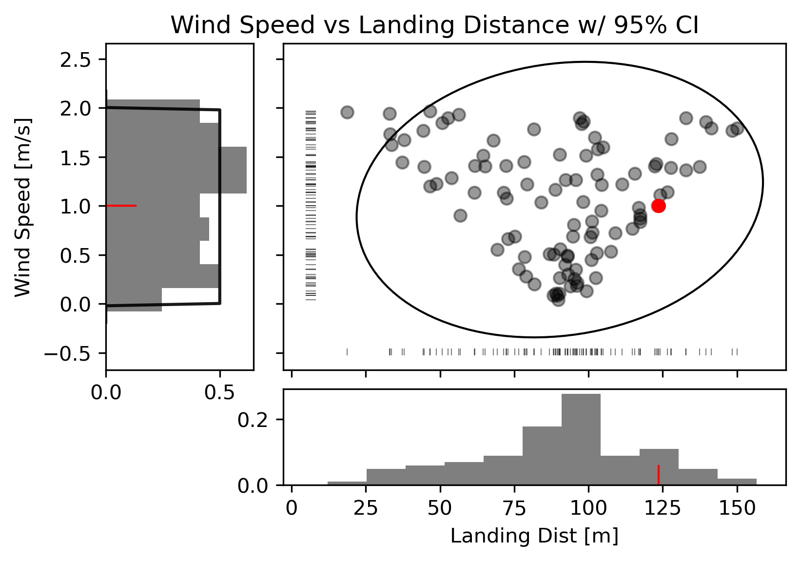

# PyMonteCarlo
This library is a work-in-progress under heavy development. Not recommended for 
outside use at this time.     
Originally created in 2020 by Scott Shambaugh during Coronavirus quarantine.

### Overview

At the heart of all serious forecasting, whether that be of elections, the 
spread of pandemics, weather, or the path of a rocket on its way to Mars, is a 
statistical tool known as the 
[Monte-Carlo method](https://en.wikipedia.org/wiki/Monte_Carlo_method).
The Monte-Carlo method, named for the rolling of the dice at the famous Monte 
Carlo casino, allows you to quantify uncertainty by introducing randomness to 
otherwise deterministic processes, and seeing what the range of results is.

PyMonteCarlo is a library for setting up, running, and analyzing Monte-Carlo 
simulations. Users can define random input variables drawn from any of SciPy's 
continuous or discrete distributions (including custom distributions), 
preprocess and structure that data as needed to feed to their main simulation, 
run that simulation anywhere from 1 to millions of times, and postprocess 
the simulation outputs to obtain meaningful, statistically significant 
conclusions. Plotting and statistical functions specific to use cases that 
might be encountered are provided.

  

### Directory Structure:

* [build](build/)
* [examples](examples/)
    - [election](examples/election/) (TODO)
    - [evidence_based_scheduling](examples/evidence_based_scheduling/) (TODO)
    - [integration](examples/integration/) (TODO)
    - [pandemic](examples/pandemic/) (TODO)
    - [retirement](examples/retirement/) (TODO)
    - [rocket](examples/rocket/)
* [PyMonteCarlo](PyMonteCarlo/)
* [templates](templates/)
* [test](test/)

### TODO:
**Before Release:**
* Flesh out READMEs and documentation
* Get parallelism working fast
* Dataframe support
* Examples:
    * Evidence-Based Scheduling
    * Market Predictions
    * Integration
    * Election Modeling
    * Pandemic Modeling
    * ~~Rocket Flight~~
* Save/load results to file
* Continue partial results
* Progress bar
* Get custom distributions working
* Break out tests
* Plot tolerance intervals as shaded regions
* Order statistics ~~tolerance interval~~ and percentiles
* 2D Scatter Statistics

**Future Work:**
* 2D/3D Line statistics?
* Make pip installable?
* Linear trend lines on scatter plots?
* Correlation matrix input?
* Ability to plot derived data in addition to mcvars?

**Done:**
* ~~3sig / X% / Mean / Min / Max statistics~~
* ~~Make template files~~
* ~~Set up directory structure~~
* ~~Make parallelism repeatable~~
* ~~Correlation matrix output for scalars~~
* ~~Put in license~~
* ~~Map custom discrete distributions to keys that pass to functions~~
* ~~Scatter-histogram multiplots~~
* ~~Automatically split outvars~~
* ~~Highlight specific case on plot~~
* ~~Specify axis to plot on~~
* ~~Seed invars with name hash~~
* ~~Plot specific cases and highlighted cases~~

### License:

This software is distributed under [the GPLv3.0 license](LICENSE.md).    
Please contact Scott Shambaugh for licensing this software for distribution in 
proprietary applications.

