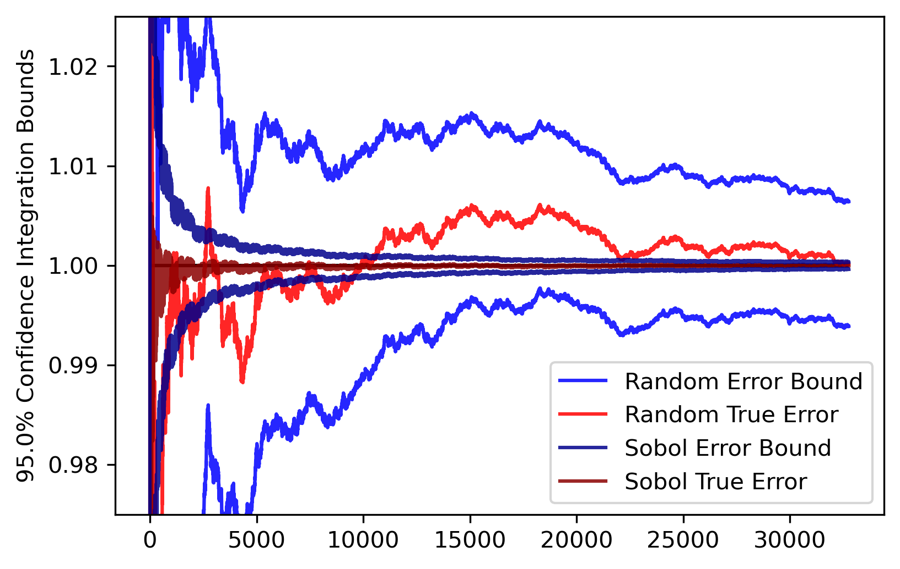
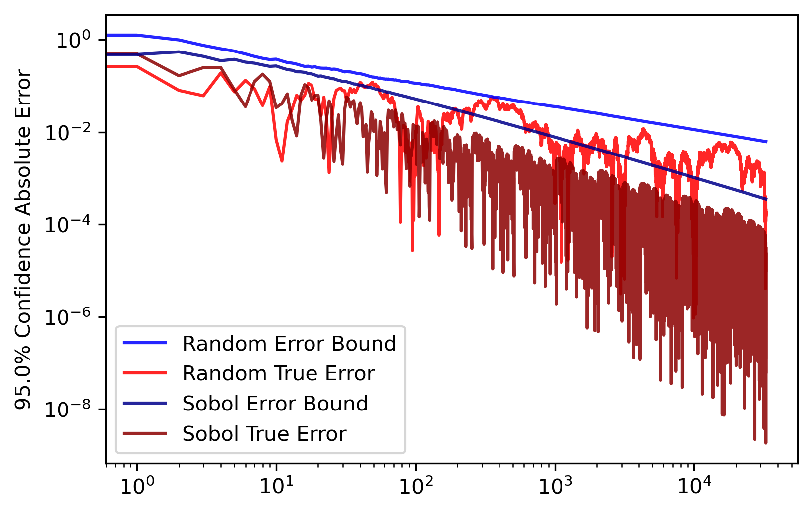
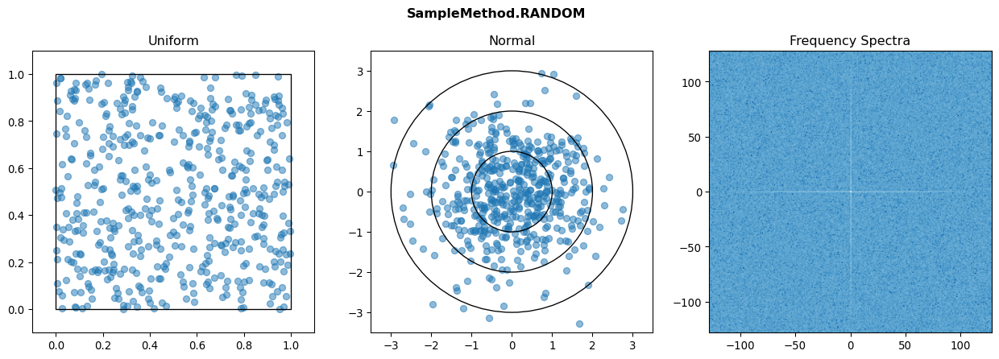
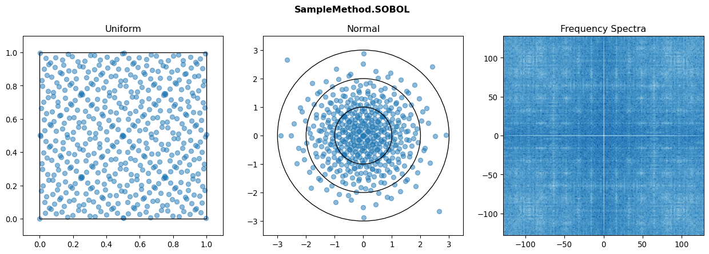
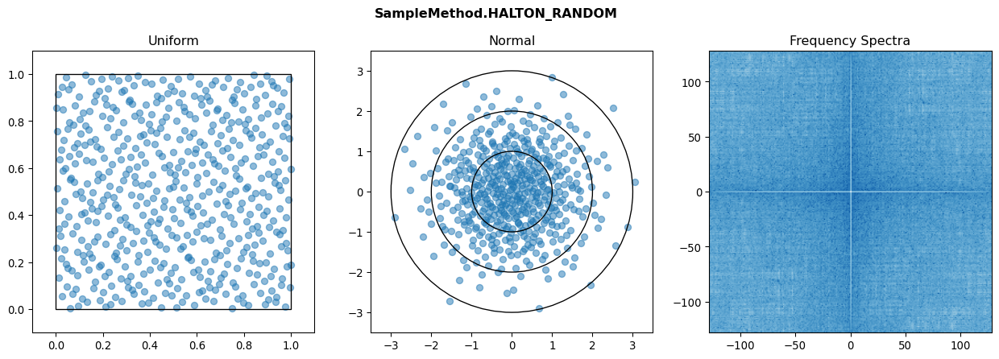
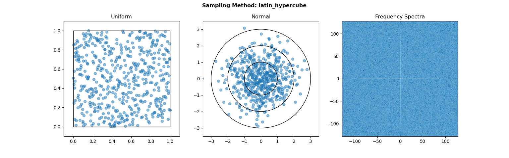

## [Monaco](../../) - Sampling Methods

### Random Sampling Methodology

The way that random samples are drawn for different probability distributions in Monaco is that random numbers are first drawn from a uniform distribution in the range [0, 1]. These represent percentiles, which are then fed into the [inverse cumulative density function](https://en.wikipedia.org/wiki/Quantile_function) of the original probablity distribution to obtain correctly-weighted draws.

### Sampling Methods

For drawing percentiles from the underlying uniform distribution, there are several sampling methods implemented in Monaco. See the [scipy.stats.qmc](https://scipy.github.io/devdocs/reference/stats.qmc.html) documentation for more info. 

The first is ```random``` sampling, which uses scipy's pseudorandom number generator as seeded by the program.

The second is ```sobol``` sampling. [Sobol's sequence](https://en.wikipedia.org/wiki/Sobol_sequence) is a well performing [quasi-random sequence](https://en.wikipedia.org/wiki/Low-discrepancy_sequence), which is designed to better fill a parameter space without gaps or clusters. Generally, Sobol sampling will lead to smoother and more accurate results, and faster convergence. However, it can also introduce unintended frequency content to the parameter space, as opposed to random's flat white noise spectrum. This is rarely an issue, but something to be aware of in niche applications. Note also several things:
* Sobol sampling cannot be used for more than 21201 input variables, and may slow way down before that. 
* Sobol sampling is unaffected by the random seed.
* If using Sobol sampling for integration, the number of samples should be a power of 2 in order for balance across the parameter space.
* Basic Sobol sampling can *not* be used for generating normal distributions since the first point always lies at 0, which maps to negative infinity on the gaussian inverse CDF. 

The third is ```sobol_random``` sampling, which takes the sequence of Sobol points and applies Owen's scrambling. This has many advantages over the basic sampling method:
* Banding is reduced and the frequency spectra is improved.
* Power of 2 integration balance is retained.
* Results vary slightly when the seed is changed.
* The point at 0 is scrambled away, so it can be used for generating any probability distribution.

The only disadvantage of ```sobol_random``` is that it is slower than ```sobol``` sampling due to the randomization and lack of caching. On my machine, drawing 10^6 points for each of 10 variables takes approximately 1 second for ```sobol_random```, and only 10 milliseconds for ```sobol```. For large numbers of input variables, this may take a significant portion of the overall Monte Carlo workflow time.

Also implemented for completeness are the ```halton```, ```halton_random```, and ```latin_hypercube``` sampling methods. However the Halton sequence usually performs worse than the Sobol sequence, and Latin Hypercube sampling performs no better than random for more than approx. 3 input variables at the cost of speed, so users generally should not use these.

### Best Practices
What sampling method should you use? ```sobol_random``` has been shown in literature to generally give the best results with fastest convergence, so it is the default. Make sure to use a power of 2 for the number of draws if performing integration. If you are drawing only from uniform distributions, you can fall back to ```sobol``` for a speedup.  ```random``` sampling should only be used as a teaching tool, if a flat frequency spectra is critical, or if the sampling time is otherwise prohibitively long. The others should not be used.

### Integration
For integration, random sampling will converge at a big O rate of , while sobol sampling over *d* dimensions will eventually converge at the faster . However, the *n* required to reach this convergence rate grows superexponentially with *d*, and for integrals larger than 3 dimensions sobol sampling will generally perform no better than random. So, if *d ≥ 4*, it is recommended to use random sampling for the speedup. Here are the error plots for a 2-D integral of the unit circle (which converges to π).

<p float="left" align="center">


</p>

### Comparison Plots
<p float="left" align="center">
  
</br>

</br>

</br>

</br>

</br>

</p>

### Further Reading
* [Roberts, Martin. "The Unreasonable Effectiveness of Quasirandom Sequences." Extreme Learning, 25 April 2018](http://extremelearning.com.au/unreasonable-effectiveness-of-quasirandom-sequences/)
* [Perrier, Hélène, et al. "Sequences with low‐discrepancy blue‐noise 2‐D projections." Computer Graphics Forum. Vol. 37. No. 2. 2018.](https://onlinelibrary.wiley.com/doi/abs/10.1111/cgf.13366)
* [Owen, Art B. "On dropping the first Sobol'point." arXiv preprint arXiv:2008.08051 (2020).](https://arxiv.org/abs/2008.08051)
* [Morokoff, William J., and Russel E. Caflisch. "Quasi-random sequences and their discrepancies." SIAM Journal on Scientific Computing 15.6 (1994): 1251-1279.](https://epubs.siam.org/doi/pdf/10.1137/0915077))
* [Chrisman, Lonnie. "Latin Hypercube vs. Monte Carlo Sampling." Analytica, 23 July 2014](https://lumina.com/latin-hypercube-vs-monte-carlo-sampling/)