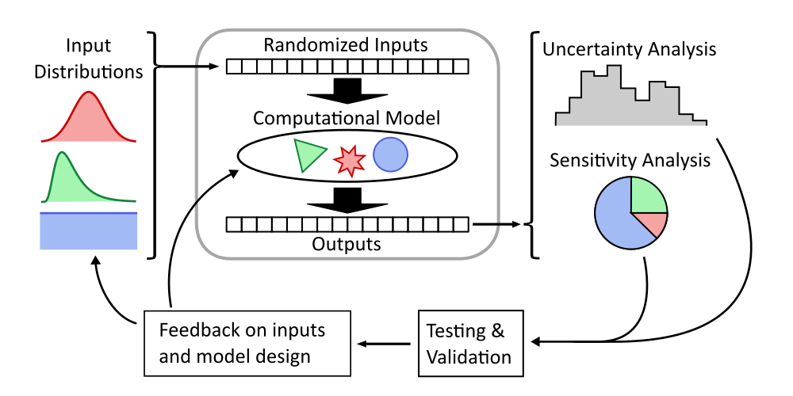

monaco
======

Quantify uncertainty and sensitivities in your computer models with an industry-grade Monte Carlo framework.

This is the detailed documentation website. For an overview of the library, it's recommended to start with `monaco's GitHub page <https://github.com/scottshambaugh/monaco/>`_.
For more information check out the left sidebar, or go straight to the :ref:`api-reference`.

.. toctree::
   :maxdepth: 3
   :hidden:

   installation.md
   basic_architecture.md
   basic_workflow.md
   processing_methods.md
   statistical_distributions.md
   sampling_methods.md
   api_reference.rst
