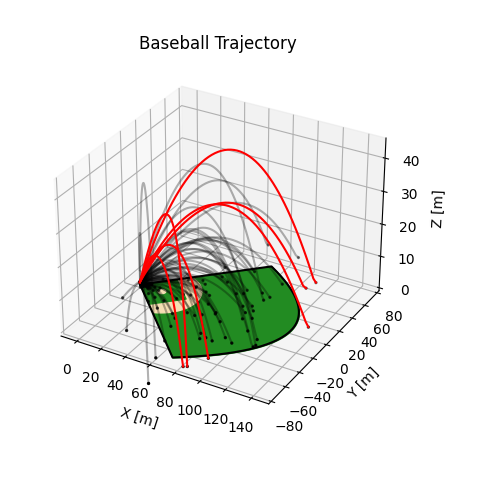
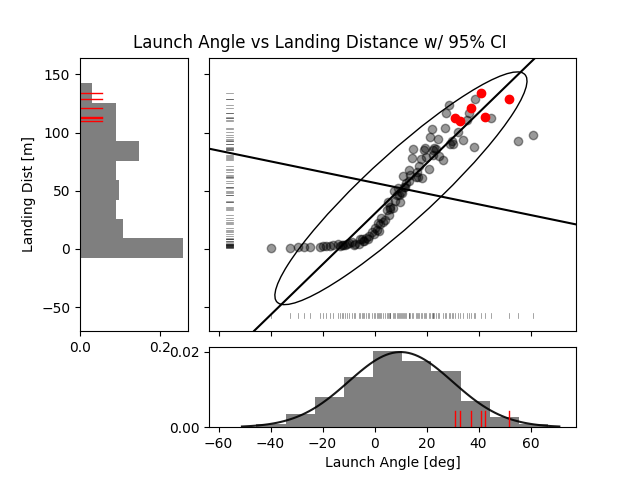
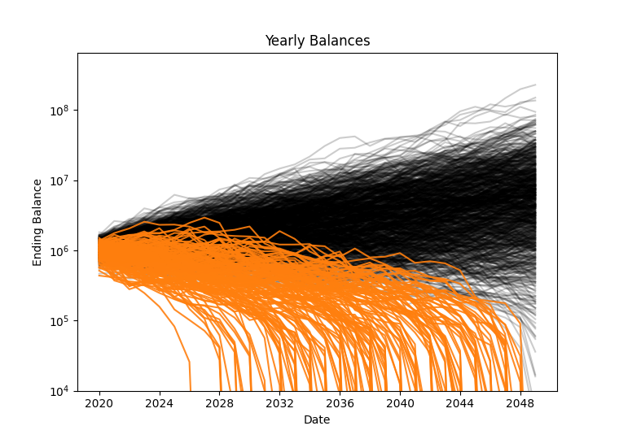
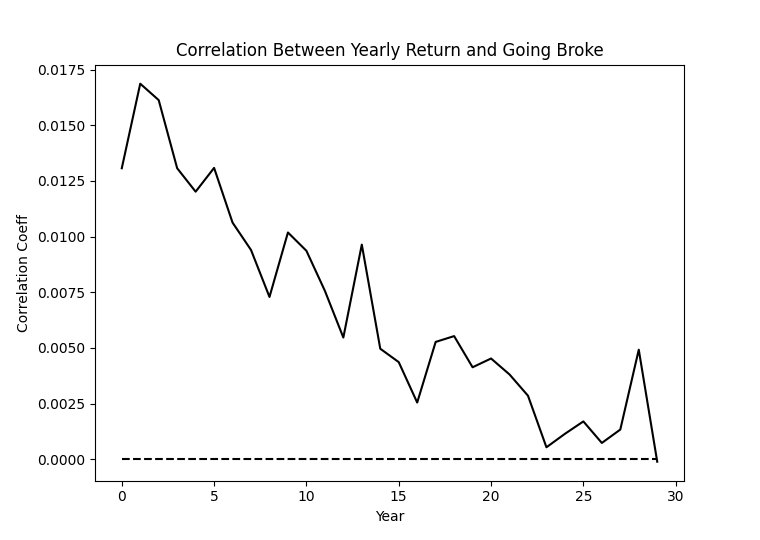
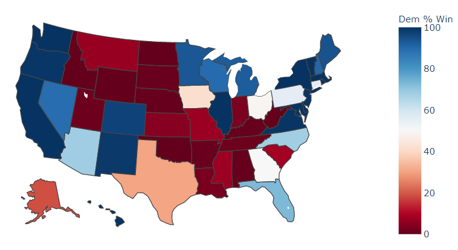
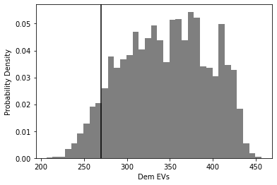
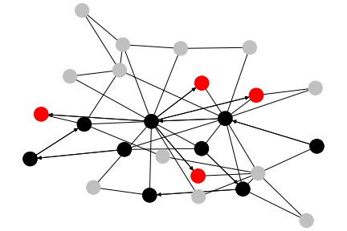
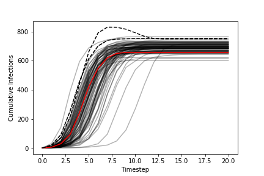

## [monaco](../) - Examples

### [Baseball](baseball/)
Models the trajectory of a baseball after being hit for varying speeds, angles,
wind conditions, and mass properties. A useful example for looking at more
complicated program inputs and outputs, and postprocessing that data into
outvars of different shapes and types. Also shows a look at generating global
sensitivity indices.

The simulation does not perform robust integration. But it does model wind,
aerodynamic drag and the magnus effect from topspin. Home runs are highlighted.

### [Early Retirement Investment Portfolio](early_retirement_investment_portfolio/)
Models an investment portfolio's balance during a retirement drawn-down, and
calculates the likelihood of going broke. A good look at using pandas for time
series data, generating input variables algorithmically, and using correlation
coefficients meaningfully.

  

### [Election](election/)
Models probabalistic outcomes for the 2020 US Presidential election, based on
state-level odds from 538's polling data and nationwide swings. A good example
of passing in constant data via addConstVal, adding and plotting order
statistics, and using a Monte Carlo in general to inform further data processing.

  

### [Evidence-Based Scheduling](evidence_based_scheduling/)
TODO. Based on [this](https://www.joelonsoftware.com/2007/10/26/evidence-based-scheduling/).

### [Integration](integration/)
Shows best practices for Monte Carlo integration, to calculate the value of pi
from the area of a circle. Please note that monaco is not particularly well
suited for the use case of Monte Carlo integration, as it requires a good bit of
memory overhead to hold its data. This example also shows all the key functions
compressed into a single file.

  
  

### [Pandemic](pandemic/)
Models the spread of a virus through a scale-free network using an SIR model. A
good look at using order statistics to figure out how many cases to run, passing
random seeds to a program during preprocessing, and some more complicated
postprocessing.

  

