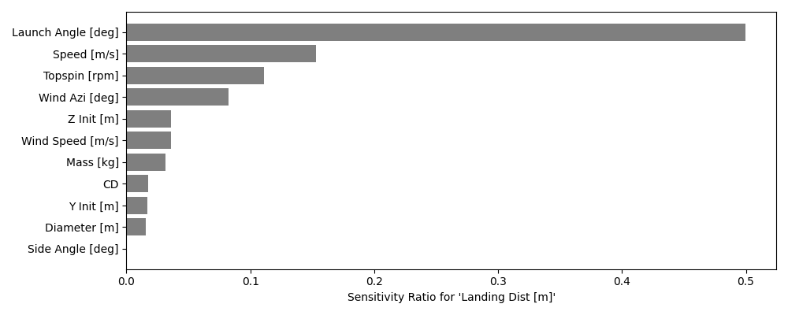

## [monaco](../../) - [Examples](../)

### Baseball
This example simulates the trajectory of a baseball after being hit.

The simulation does not perform robust integration. But it does model wind,
aerodynamic drag and the magnus effect from topspin. Home runs are highlighted.

