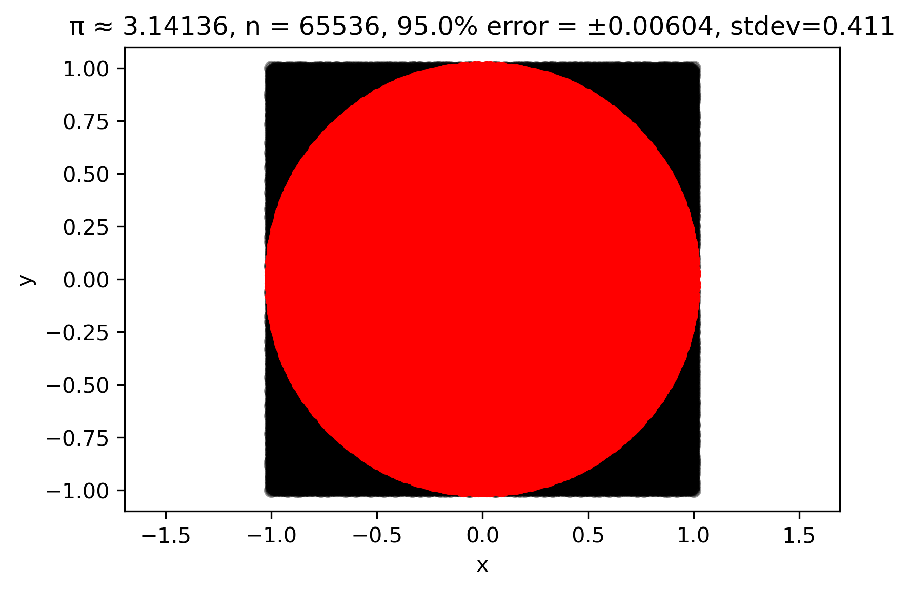
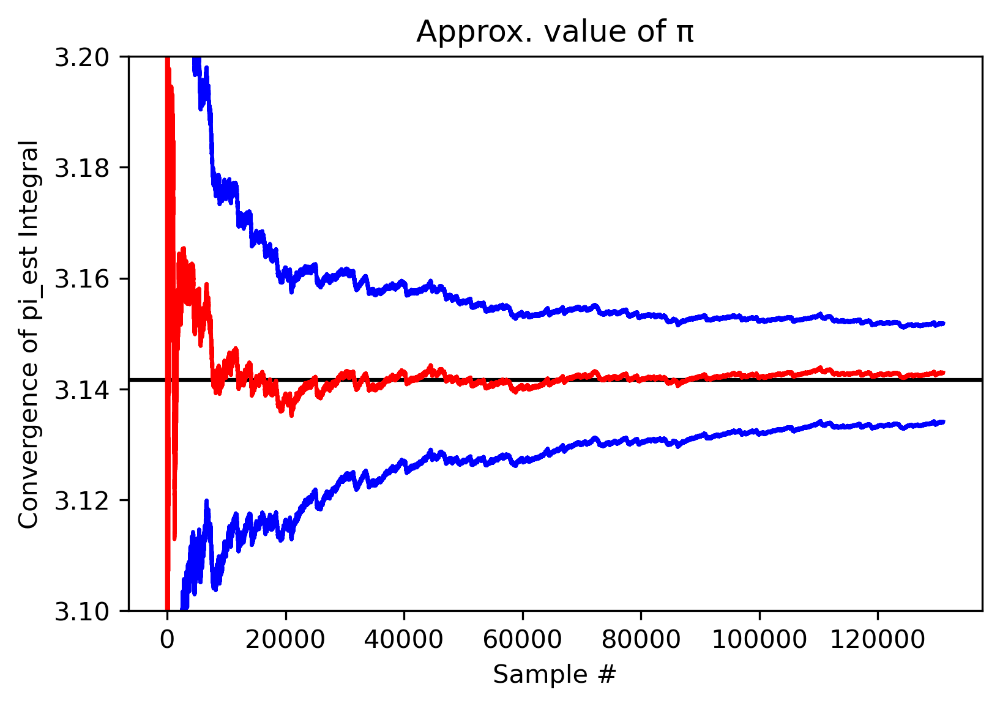
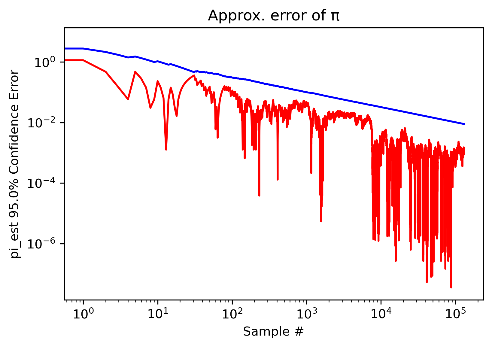

## [monaco](../../) - [Examples](../)

### Integration
This calculates the value of pi by [Monte Carlo integration](https://en.wikipedia.org/wiki/Monte_Carlo_integration), via the formula for the area of a circle *a = pi \* r^2*. Please note that monaco is not particularly well suited for the use case of Monte Carlo integration, as it requires a good bit of memory overhead to hold its data. My python session crashes somewhere between 1e6 and 1e7 random draws. A simple 'for' loop will likely have better performance, and this is a task that will greatly benefit from compilation. There are also much more efficient integration sampling methods out there, and anyone interested should look into "stratified" or "importance" sampling.

  
  
 
  

